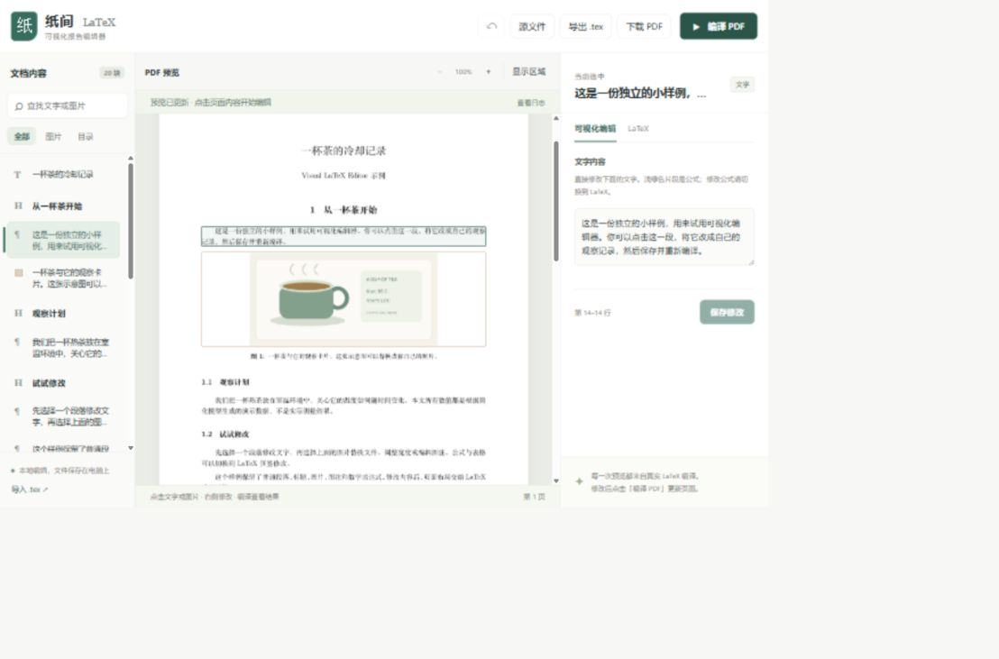

# Visual LaTeX Editor · 纸间

[English](README.md) · [示例 PDF](docs/tea-example.pdf)

在本地运行的 LaTeX 可视化编辑器。点击**实际编译的 PDF** 中的文字或图片，在右侧修改，再编译查看排版结果。无需账号，也无需构建前端。



## 功能

- 从 PDF 或左侧文档列表选中段落、标题、公式、表格、图片与图注。
- 普通文字直接编辑；行内公式保留为独立片段，修改公式时切换到 LaTeX。
- 替换 PNG、JPG、WebP 图片，调整图片尺寸与图注。
- 编辑选中块的 LaTeX，或打开完整源文件。
- 保存、撤销最近的块保存、查找、缩放、查看编译日志。
- 下载 PDF，或导出包含图片的单文件 `.tex`。
- 编译失败时保留上一次成功的 PDF。

这是按源文件内容块进行编辑的工具。公式、表格和复杂布局仍通过 LaTeX 修改；图片整体替换。PDF 点击区域通过 SyncTeX 定位，复杂宏可能导致区域不够准确，此时可使用左侧列表选中内容。

## 安装与启动

需要 Python **3.10+**、[Tectonic](https://tectonic-typesetting.github.io/book/latest/installation/) 和 Poppler 的 `pdftoppm`。

使用 Conda / Miniforge 可以统一安装 Windows、macOS、Linux 的编译与渲染工具：

```sh
conda create -n visual-latex -c conda-forge python=3.11 tectonic poppler
conda activate visual-latex
git clone https://github.com/Kotori-cjk/visual_latex_editor.git
cd visual_latex_editor
python -m pip install -e .
visual-latex-editor --check
visual-latex-editor --open
```

浏览器访问 **http://127.0.0.1:8765**。首次编译可能需要联网下载宏包与字体；之后使用缓存。关闭服务器时在启动终端按 **Ctrl+C**。

如果已经装好编译工具，可以创建 Python 虚拟环境并运行：

```sh
python -m venv .venv
# Windows：.venv\Scripts\activate
# macOS/Linux：source .venv/bin/activate
python -m pip install -e .
python -m visual_latex_editor --open
```

安装后也可以使用 `scripts/start.cmd` 或 `sh scripts/start.sh`。工具不在 `PATH` 时，用 `--tectonic` 和 `--pdftoppm` 传入可执行文件的路径；Windows 下指向 `.exe`：

```sh
visual-latex-editor --tectonic /path/to/tectonic --pdftoppm /path/to/pdftoppm --open
```

也支持环境变量 `VISUAL_LATEX_TECTONIC`、`VISUAL_LATEX_PDFTOPPM`。完整参数见 `visual-latex-editor --help`。

## 试用小样例

默认载入原创的《一杯茶的冷却记录》：两页内容，包括普通文字、两张原创示意图、冷却公式与表格。所有数值都是模型生成的演示数据。

1. 点击 PDF 中的段落，在右侧修改文字，点击「保存修改」或按 **Ctrl+S**。
2. 点击茶杯图片，选择新图片，修改大小与图注，然后保存。
3. 点击「编译 PDF」刷新真实排版。
4. 下载 PDF，或导出包含图片的 `.tex`。

公式、表格和图片是独立内容，修改公式不会自动更新图像与表格数据。示例源文件位于 [`src/visual_latex_editor/example/demo.tex`](src/visual_latex_editor/example/demo.tex)，图片生成脚本位于 [`scripts/make_example_images.py`](scripts/make_example_images.py)。

## 文档保存与导入导出

默认在启动目录的 `.visual_latex_editor/` 中保存编辑副本、图片与编译历史，该目录已加入 `.gitignore`。使用 `--project /path/to/my-document` 可以指定另一个项目目录，每个目录保存一个活动文档。

保存后重启不会丢失内容。撤销记录只保留在当前浏览器会话中，最多 25 次块保存。源文件另存有最近一次保存前的副本，编译历史也会保留在磁盘上。

导入需要具有 `document` 环境的完整单文件 `.tex`。本编辑器导出的文件可以直接重新导入；普通源文件的外部图片需要放到项目的 `assets/` 中，或通过界面替换。导出时将图片转成白底 JPEG 并封装成 ASCII PDF，通过 `filecontents*` 嵌入 `.tex`。

初版暂不支持多文件工程、参考文献工程、自定义宏包、任意 PDF/矢量图或复杂宏生成的布局。服务器仅监听本机地址，适合单人编辑可信文档。

## 测试与开发

```sh
python -m unittest discover -s tests -v
node --check src/visual_latex_editor/static/app.js
python scripts/check_integration.py
```

最后一项需要编译与渲染工具，验证真实 PDF 编译、文字保存、图片替换、编译失败恢复和独立导出。测试使用临时文档，不修改已有文档。GitHub Actions 配置了三个平台的单元测试、wheel 打包以及 Linux 上的真实编译测试。

贡献方式见 [CONTRIBUTING.md](CONTRIBUTING.md)，本地运行范围见 [SECURITY.md](SECURITY.md)。代码、原创示例与插图采用 [MIT 许可证](LICENSE)；编译工具与 Python 依赖各自使用其原有许可证。
